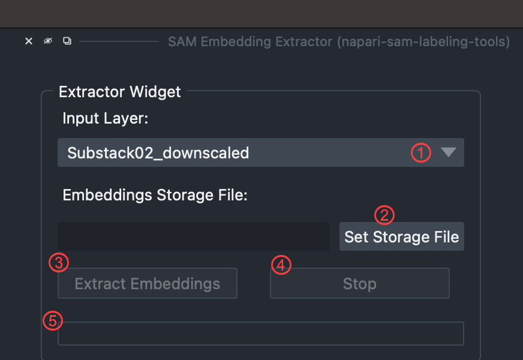
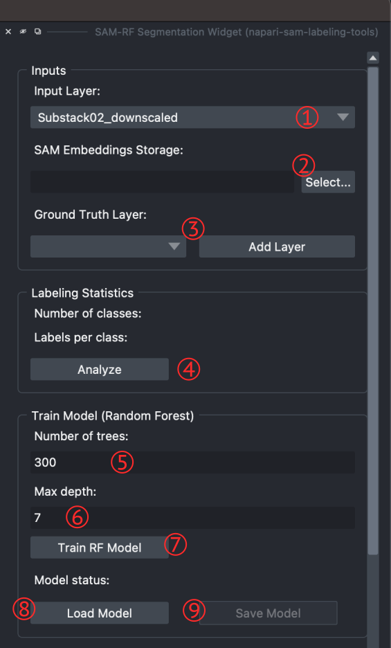
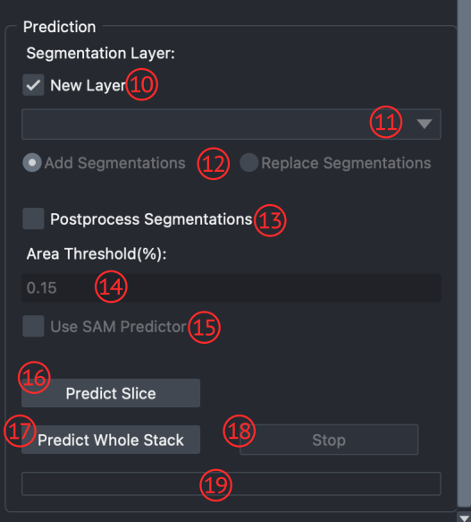
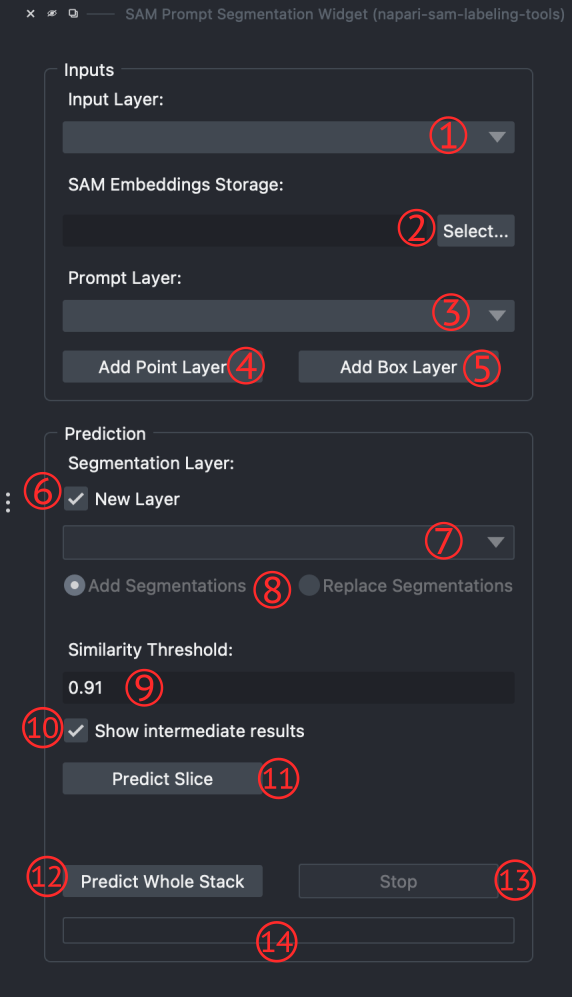
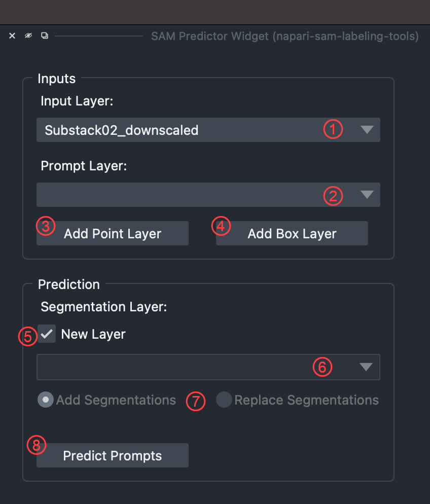

<p align="center">
  <a href="https://ai4life.eurobioimaging.eu/open-calls/">
    
  </a>
</p>

# Project #52: Atlas of Symbiotic partnerships in plankton revealed by 3D electron microscopy
---

**Johan Decelle** (CNRS Grenoble France) and his colleagues are working on the **AtlaSymbio** project. The major aim of the AtlaSymbio project is to build a subcellular atlas of different symbioses of the plankton.  
In this OpenCall project, we tried to help scientists study and model microalgae in free-living cell form and their transformations into symbiotic form.  

>"The main research question is to observe how symbiotic microalgae inside hosts are morphologically remodeled using 3D electron microscopy such as FIB-SEM."  

The main problem was **semantic segmentation** of Electron Microscopy 3D images (FIB-SEM) using any proper deep learning model. Unfortunately, there were not enough ground-truth annotations for training such a model. Also, doing manual annotations is very time-consuming and extremely expensive.  
Therefore, we decided to hit this challenge using a different approach. We developed a *napari* plugin to train a *Random Forest* model using extracted embeddings of the *SAM* model for input and just a few scribble labels provided by the user. This approach can do the segmentation of desired organelles almost as well as manual segmentations but in a much shorter time with less manual effort. For the method details, see [here](https://github.com/juglab/napari-sam-labeling-tools/blob/main/docs/index.md).  

## Installation
It is highly recommended to use a python environment manager like conda to create a clean environment for the installation.
You can install all the requirements by one command using provided environment config file (env.yml):
```bash
conda env create -f ./env.yml
```

### Requirements
- `python >= 3.9`
- `numpy`
- `opencv-python`
- `scikit-learn`
- `scikit-image`
- `matplotlib`
- `pyqt`
- `magicgui`
- `qtpy`
- `napari`
- `h5py`
- `pytorch`
- `tochvision`
- `timm`
- `pynrrd`

If you want to use GPU, please follow the pytorch installation instruction [here](https://pytorch.org/get-started/locally/).  
For detailed napari installation see [here](https://napari.org/stable/tutorials/fundamentals/installation).

### Installing The Plugin
To install the plugin, first clone the repository:
```bash
git clone https://github.com/juglab/napari-sam-labeling-tools
```
Then run the following commands:
```bash
cd ./napari-sam-labeling-tools
pip install .
```

## How to use the plugin
This plugin provides four widgets:
- [SAM Embedding Extractor Widget](#sam-embedding-extractor-widget)
- [SAM-RF Widget](#sam-rf-widget)
    - [Notes](#notes)
- [SAM Prompt Segmentation Widget](#sam-prompt-segmentation-widget)
- [SAM Predictor Widget](#sam-predictor-widget)

Firs, you need extract the SAM embedding out of your stack. To do that use [SAM Embedding Extractor Widget](#sam-embedding-extractor-widget) widget.  
After you extract the embeddings into a storage file, use [SAM-RF Widget](#sam-rf-widget) and start adding some labels for the object of interest vs. the rest(background). *Please remember that you should start with the background and always use label **1** for the background*.

### SAM Embedding Extractor Widget
The first step is to extract the SAM embeddings for the input stack, using the "SAM Embedding Extractor" widget. To do so, simply choose where to save the embedding storage file and hit the "Extract" button.  



1. **Input layer combo box:** to select input image (stack)
2. **Set storage:** to select where the storage should be saved.
3. **Extract Embeddings button:** to start extracting SAM embeddings
4. **Stop button:** to stop the extraction process.
5. **Process progress bar:** showing extraction progress.  
<br><br>

### SAM-RF Widget
This widget is designed to perform segmentation while using the SAM embedding features instead of the image features, along with the user-provided sparse labels using a *Random Forest* model.  
The number of required labels for having almost nice-looking segmentations compared to the number of pixels is super low. The provided *postprocessing* methods can create even more accurate and cleaner annotations.  



1. **Input layer combo box:** to select input image (stack).
2. **Embedding Storage Select button:** to select the embedding storage file.
3. **Ground Truth Layer:** to select or add a new ground truth layer (napari Labels layer).
4. **Analyze button:** to check number of user-provided labels for each class.
5. **Random Forest Number of trees:** to set number of trees for the RF model.
6. **Random Forest Max depth:** to set maximum depth for each tree in the RF model. pass 0 to set it as *unlimited*.
7. **TrainRF Model button:** to start training of the RF model.
8. **Load Model button:** to load an already trained RF model.
9. **Save Model button:** to save the trained RF model.
<br>



10. **New Layer checkbox:** if checked, the segmentations result will be added into a new layer.
11. **Segmentation layer combo box:** if *New Layer* is unchecked, then user must select the segmentations layer.
12. **Segmentation layer options:**
    - **Add Segmentations:** the result will be added to the selected layer. In other words, pixels which segmented as non-background will be added to the selected layer.
    - **Replace Segmentations:** the selected layer content will be replaced with the result.
13. **Postprocess Segmentation checkbox:** if checked, the segmentations result will be postprocessed.
14. **Area Threshold inputbox:** if postprocess checked, then the area threshold will be used to eliminate small segmented objects with area below the set threshold. The higher the area threshold, the more segmented objects will be eliminated.
15. **Use SAM Predictor checkbox:** to use *SAM predictor* model to predict final segmentations using the RF model prediction as input prompts (prompts will be bounding boxes around RF segmented objects).
16. **Predict Slice button:** to run the prediction for the current image slice.
17. **Predict Whole Stack button:** to run prediction for the whole loaded stack.
18. **Stop button:** to stop the prediction process (whole stack prediction migth take a long time).
19. **Prediction Progressbar:** to show the prediction progress.  
<br>

#### Notes
- You should always use label **1** for the background class.
- If your stack is large, extracting embeddings can take a long time and creates a huge storage file. Therefore, it is recommended to use a sub-stack of the original stack by selecting a few slices from the beginning of the stack, a few in the middle, and a few slices from the end. Then use this sub-stack to train the RF model, save it, and then use it for prediction over the whole stack.  
To do so, we provided a **[jupyter notebook](./run_pipeline_for_whole_stack/run_pipeline.ipynb)** that you can use with just setting the input and saved RF model path.  

- Making a good segmentation using this SAM-RF widget needs a iterative process; meaning that first you add some labels, train the model, and then predict. Then to improve the results, iterate over and add more labels, train and predict, and so forth... .

- Although the trained RF model can be used on a stack with a different image resolution, the results might not be as good as the trained resolution. Also, if one of stacks (used for training or prediction) has a resolution below of 612, this not the case anymore because the storage patch size will be different.
<br><br>

### SAM Prompt Segmentation Widget
In this widget, you can make segmentation by only putting a few prompts into the prompt layer. The prompt layer's type can be point or box.  
After setting the prompts and hitting the *Predict* button, a mask will be generated by the SAM predictor. Then by taking the average of all pixels in the predicted mask, using SAM embedding space (in the storage file), a feature vector will be calculated. The similarity matrix is computed by taking the cosine similarity between each pixel's feature vector and the obtained average vector.  
After thresholding the similarity matrix, new prompts will be generated inside the remaining areas (of the similarity matrix). Finally, the generated prompt passes through the SAM predictor, and the final segmentation mask will be generated.



1. **Input layer combo box:** to select input image (stack).
2. **Embedding Storage Select button:** to select the embedding storage file.
3. **Prompt layer combo box:** to select the input prompt layer.
4. **Add Point Layer button:** to add a new point prompt layer.
5. **Add Box Layer button:** to add a new box prompt layer (basically it's a napari shapes layer).
6. **New Layer checkbox:** if checked, the segmentations result will be added into a new layer.
7. **Segmentation layer combo box:** if *New Layer* is unchecked, then user must select the segmentations layer.
8. **Segmentation layer options:**
    - **Add Segmentations:** the result will be added to the selected layer. In other words, pixels which segmented as non-background will be added to the selected layer.
    - **Replace Segmentations:** the selected layer content will be replaced with the result.
9. **Similarity Threshold inputbox:** pixels with cosine similarity above this threshold will be added to the segmentation mask for the next step.
10. **Show Intermediate Results checkbox:** if checked, the intermediate calculations including user prompt mask, similarity matrix, selected areas, and generated prompts will be shown as layers.
11. **Predict Slice button:** to run the prediction for the current image slice.
12. **Predict Whole Stack button:** to run prediction for the whole loaded stack.
13. **Stop button:** to stop the prediction process (whole stack prediction migth take a long time).
14. **Prediction Progressbar:** to show the prediction progress.  
<br><br>

## SAM Predictor Widget
This widget simply uses the user prompts and gives them to the SAM predictor model to get the segmentations. Prompts can be in the form of points (only positive) or boxes.  
This widget works nicely for objects having more clear boundaries. It also can be used as a complementary method over the **SAM-RF Widget**.



1. **Input layer combo box:** to select input image (stack).
2. **Prompt layer combo box:** to select the input prompt layer.
3. **Add Point Layer button:** to add a new point prompt layer.
4. **Add Box Layer button:** to add a new box prompt layer (basically it's a napari shapes layer).
5. **New Layer checkbox:** if checked, the segmentations result will be added into a new layer.
6. **Segmentation layer combo box:** if *New Layer* is unchecked, then user must select the segmentations layer.
7. **Segmentation layer options:**
    - **Add Segmentations:** the result will be added to the selected layer. In other words, pixels which segmented as non-background will be added to the selected layer.
    - **Replace Segmentations:** the selected layer content will be replaced with the result.
8. **Predict Prompts button:** to do the prediction using SAM's predictor.  
<br><br><br><br>

**AI4Life** has received funding from the European Union’s Horizon Europe research and innovation programme under grant agreement number 101057970. Views and opinions expressed are however those of the author(s) only and do not necessarily reflect those of the European Union or the European Research Council Executive Agency. Neither the European Union nor the granting authority can be held responsible for them.  
